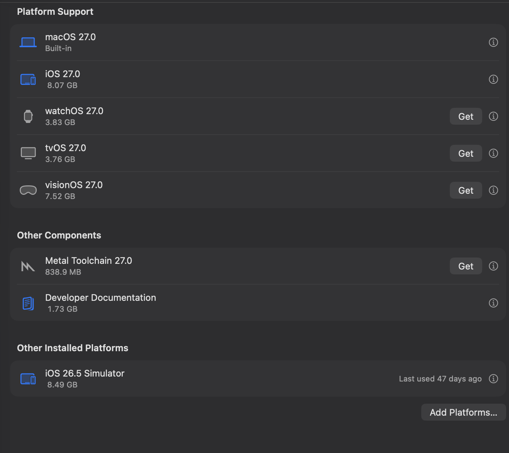
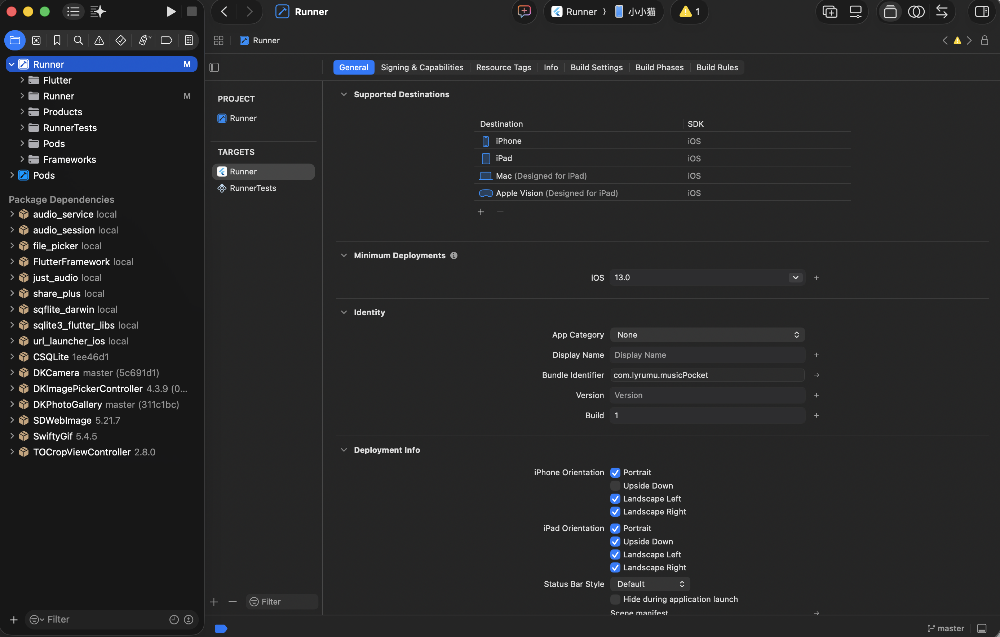
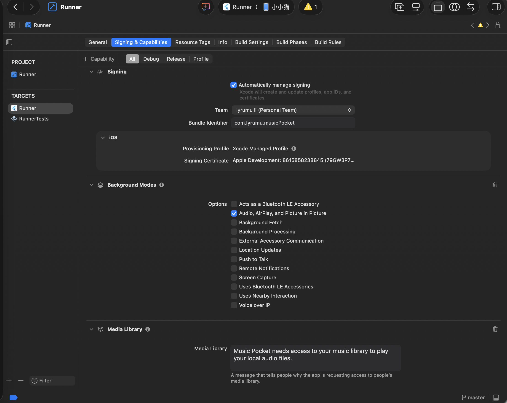
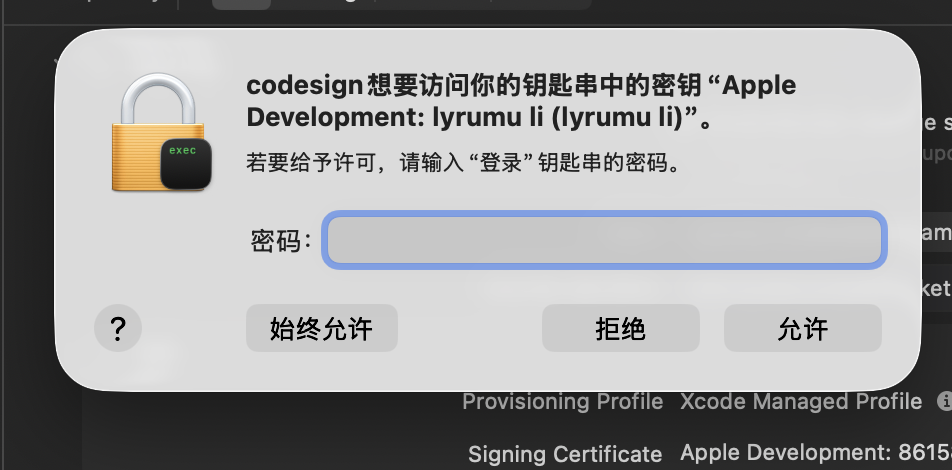
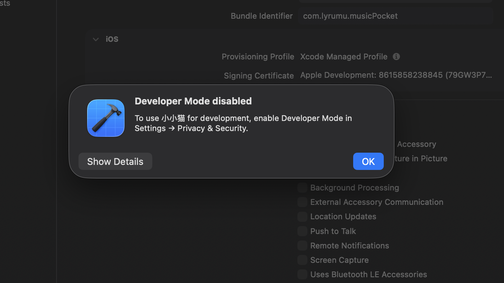
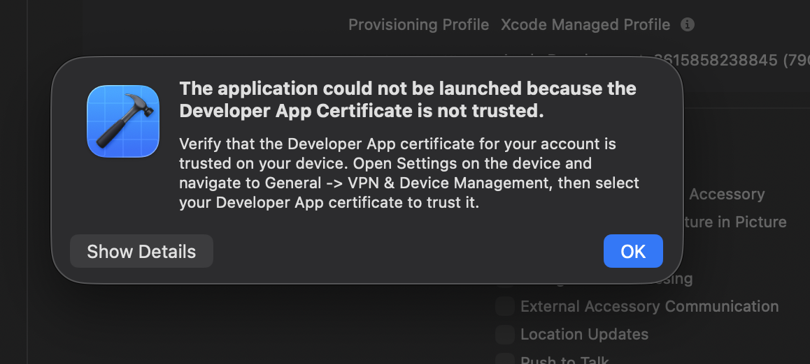
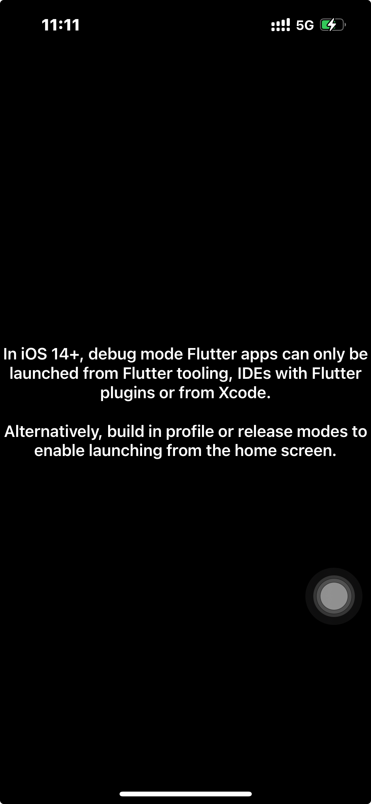

> 适用于：在 Mac 上把已有 Flutter 项目安装到自己的 iPhone。
>
> 免费 Apple Account 可真机测试；`Personal Team` 安装的 App 通常 7 天后需重新签名。TestFlight 和 App Store 发布需要加入 Apple Developer Program。

文中的路径、Bundle ID、设备名和账号均为示例。

## 1. 准备环境

需要 Mac、iPhone、支持数据传输的连接线、Xcode、Flutter SDK 和 Apple Account。首次配置可能下载十几 GB 的 iOS 组件、调试符号和构建缓存。

```bash
# 检查 Flutter、Xcode 和 CocoaPods
flutter doctor -v

# 查看 Xcode 版本
xcodebuild -version
```

如果刚安装或更新 Xcode：

```bash
# 配置并初始化 Xcode 命令行工具
sudo sh -c 'xcode-select -s /Applications/Xcode.app/Contents/Developer && xcodebuild -runFirstLaunch'
```

缺少 iOS 组件时，在 `Xcode → Settings → Components` 下载 iOS Platform Support。真机部署不需要 watchOS、tvOS、visionOS 或全部模拟器。



***

## 2. 打开项目

在包含 `pubspec.yaml` 的项目根目录执行：

```bash
# 替换为自己的项目路径
cd /path/to/your_flutter_project

# 获取依赖
flutter pub get

# 打开 iOS 工作区
open ios/Runner.xcworkspace
```

应打开 `Runner.xcworkspace`，不要打开 `Runner.xcodeproj`。

***

## 3. 连接设备并配置签名

1. 在 `Xcode → Settings… → Apple Accounts` 登录 Apple Account。
2. 解锁 iPhone，用数据线连接 Mac；手机提示时选择“信任”并输入锁屏密码。
3. 手机显示充电是正常的，供电和数据传输可同时进行。
4. 用下面的命令确认 Flutter 已识别设备：

```bash
# 等待 Flutter 发现已连接的 iPhone
flutter devices --device-timeout 60
```

然后在 Xcode 中选择蓝色 `Runner` 项目，并在 `TARGETS` 下选择 `Runner`：



进入 `Signing & Capabilities`：

- 勾选 `Automatically manage signing`。
- `Team` 选择自己的 `Personal Team`。
- `Bundle Identifier` 必须唯一，例如 `com.example.myFlutterApp`。
- 顶部运行目标选择已连接的 iPhone。



按 `⌘R` 或点击 `▶` 开始编译和安装。

***

## 4. 完成首次授权

### 钥匙串

如果 macOS 提示 `codesign` 访问“登录”钥匙串，输入 **Mac 登录密码**并点击“始终允许”。它不是 Apple Account 密码，也不是 iPhone 锁屏密码。



### 开发者模式

出现 `Developer Mode disabled` 时：



在 iPhone 打开 `设置 → 隐私与安全性 → 开发者模式`，开启并按提示重启；解锁后再次确认。如果最初没有该选项，先让 Xcode 尝试运行一次。

### 信任开发者证书

出现 `Developer App Certificate is not trusted` 时：



在 iPhone 打开 `设置 → 通用 → VPN 与设备管理 → 开发者 App`，选择证书并信任，然后回到 Xcode 再按 `⌘R`。

首次连接时 Xcode 还可能复制系统调试符号，保持手机解锁和连接，等待完成即可。

***

## 5. Debug 与 Release

```bash
# 开发调试，支持热重载
flutter run -d <iPhone设备ID>

# 安装可直接从桌面启动的 Release 版本
flutter run --release -d <iPhone设备ID>
```

在较新的 iOS 上，Debug 版通常只能由 Xcode、Flutter 命令或支持 Flutter 的 IDE 启动。直接点击桌面图标出现下图提示，并不代表安装失败：



确认 Release 版能从桌面打开后，即可关闭 Xcode 并断开数据线。

***

## 6. 免费账号的 7 天限制

`Personal Team` 的签名通常 7 天后到期。届时重新连接 iPhone，用原 Bundle ID 覆盖安装即可：

```bash
# 重新签名并覆盖安装 Release 版本
flutter run --release -d <iPhone设备ID>
```

通常不必先删除 App；覆盖安装一般会保留数据，但重要数据仍应备份。具体限制以 [Apple 官方说明](https://developer.apple.com/help/account/basics/about-your-developer-account) 为准。

***

## 7. 常见问题

### iPhone 只充电，电脑识别不到

保持手机解锁，确认已“信任此电脑”，并检查线缆是否支持数据传输；必要时更换接口或线缆，再运行 `flutter devices --device-timeout 60`。

### Bundle Identifier 无法注册

换成唯一的反向域名，例如 `com.<你的标识>.<应用名>`，并保持自动签名开启。

### 最低 iOS 版本过低

按报错要求提高 Runner 的 `Minimum Deployments`，并同步修改 `ios/Podfile`，例如：

```ruby
platform :ios, '15.0'
```

```bash
# 重新生成 iOS Pods
cd ios
pod install
cd ..
```

提高最低版本后，更旧的 iOS 设备将不再受支持。

### 磁盘空间减少十几 GB

通常来自 iOS Platform Support、模拟器、调试符号和构建缓存，属于正常现象。不需要的旧模拟器可在 `Xcode → Settings → Components` 中删除。

***

## 8. 发布到 TestFlight 或 App Store

正式分发需要加入 Apple Developer Program，并在 App Store Connect 配置应用信息：

```bash
# 构建正式分发包
flutter build ipa --release
```

随后通过 Xcode Organizer 验证并上传。

***

## 最后检查

- `flutter doctor -v` 显示 Xcode 工具链可用。
- `flutter devices` 能识别 iPhone。
- 已开启开发者模式并信任证书。
- Runner 的 Team 正确、Bundle ID 唯一。
- Release 版可从手机桌面启动。

***

## 官方参考

- [Flutter：配置 iOS 开发环境](https://docs.flutter.dev/platform-integration/ios/setup)
- [Flutter：构建并发布 iOS 应用](https://docs.flutter.dev/deployment/ios)
- [Apple：在真机上运行 App](https://developer.apple.com/documentation/xcode/building-and-running-an-app)
