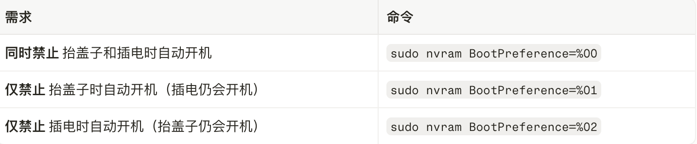

## 关闭截图音效（Command + Shift + 4）

### 关闭

```zsh
defaults write com.apple.screencapture disable-sound -bool true
killall SystemUIServer
```

### 恢复

```zsh
defaults write com.apple.screencapture disable-sound -bool false
```

***

## 关闭 Mac 插电或抬盖自动开机（Apple Silicon）

> 适用于搭载 Apple 芯片且运行 macOS Sequoia 15 或更高版本的 Mac 笔记本电脑。详见 [Apple 支持文档](https://support.apple.com/zh-cn/120622)。

### 关闭

```zsh
sudo nvram BootPreference=%00
```

需要输入管理员密码以执行。

### 恢复

```zsh
sudo nvram -d BootPreference
```



***

## 默认显示 Finder 隐藏文件

### 显示

```zsh
defaults write com.apple.finder AppleShowAllFiles -bool true
killall Finder
```

### 恢复

想**恢复默认隐藏**，把 `true` 改为 `false` 后再执行一次即可。
